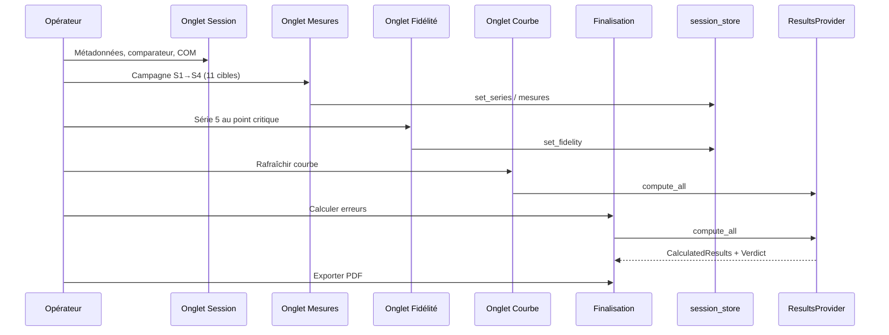
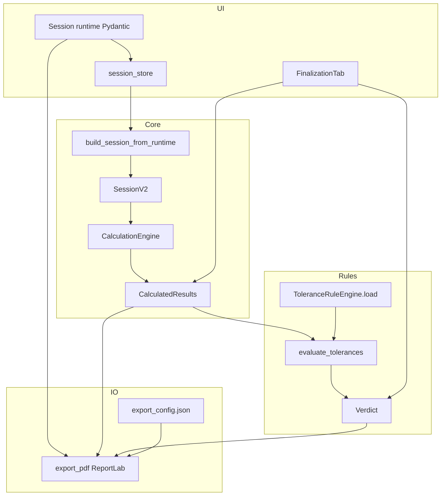
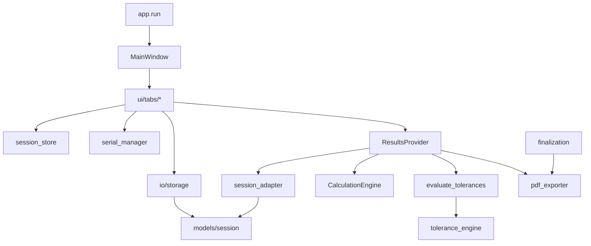

# Synthèse architecture détaillée — EtaComp2K25

**Version applicative :** 1.0.0  
**Date du document :** 2 juin 2026  
**Public :** développeurs, métrologues techniques, mainteneurs

---

## Sommaire

1. [Présentation et périmètre](#1-présentation-et-périmètre)
2. [Stack technique et déploiement](#2-stack-technique-et-déploiement)
3. [Structure du dépôt](#3-structure-du-dépôt)
4. [Architecture en couches](#4-architecture-en-couches)
5. [Démarrage et cycle de vie](#5-démarrage-et-cycle-de-vie)
6. [Modèles de données](#6-modèles-de-données)
7. [Session runtime et SessionV2](#7-session-runtime-et-sessionv2)
8. [Moteur de calcul métrologique](#8-moteur-de-calcul-métrologique)
9. [Tolérances et verdict](#9-tolérances-et-verdict)
10. [ResultsProvider — façade d’analyse](#10-resultsprovider--façade-danalyse)
11. [Interface utilisateur (onglets)](#11-interface-utilisateur-onglets)
12. [Acquisition série TESA](#12-acquisition-série-tesa)
13. [Persistance et fichiers utilisateur](#13-persistance-et-fichiers-utilisateur)
14. [Export PDF](#14-export-pdf)
15. [Configuration applicative](#15-configuration-applicative)
16. [État global et signaux Qt](#16-état-global-et-signaux-qt)
17. [Outils et migrations](#17-outils-et-migrations)
18. [Tests automatisés](#18-tests-automatisés)
19. [Dette technique et points d’attention](#19-dette-technique-et-points-dattention)
20. [Annexes — diagrammes](#20-annexes--diagrammes)

---

## 1. Présentation et périmètre

### 1.1 Finalité métier

**EtaComp2K25** est une application **desktop** destinée à la **vérification métrologique** des comparateurs mécaniques à cadran et des comparateurs numériques à tige rentrante. Elle accompagne l’opérateur de bout en bout :

- définition du profil instrument (11 cibles, graduation, course, famille) ;
- conduite guidée d’une campagne de mesures (montée / descente, 4 séries principales + série de fidélité) ;
- calcul automatique des erreurs réglementaires (totale, locale, hystérésis, fidélité) ;
- comparaison aux tolérances configurables ;
- visualisation (tableau, courbe d’étalonnage, écarts de fidélité) ;
- production d’un **constat de vérification PDF** avec verdict **Conforme / Non conforme / Indéterminé**.

### 1.2 Contexte matériel

| Élément | Rôle |
|--------|------|
| **Banc de contrôle** | Support mécanique, zéro de référence (ex. BZMA-4Q044501E) |
| **Dispositif TESA** | Colonne ou afficheur numérique ; étalon de référence ; liaison **RS-232 / USB** (émulation COM) |
| **PC** | Héberge l’application ; stocke données et exports sous le profil utilisateur |

Conditions recommandées : laboratoire stabilisé (20 °C ± 2 °C), instrument préparé (nettoyage, absence de point dur).

### 1.3 Utilisateur cible

**Opérateur métrologue** : crée ou charge une session, réalise les mesures, consulte les résultats, valide le verdict, exporte le constat PDF.

### 1.4 Périmètre fonctionnel (état v1.0.0)

| Domaine | Implémenté |
|---------|------------|
| Bibliothèque comparateurs (CRUD, 11 cibles, périodicité) | Oui |
| Détenteurs (code ES) et bancs étalon | Oui |
| Session (métadonnées, sauvegarde/chargement JSON) | Oui |
| Campagne 4 séries + série 5 fidélité | Oui |
| Acquisition TESA (mode bouton, paramètres ASCII) | Oui |
| Calculs Emt, Eml, Eh, Ef | Oui |
| Règles de tolérances (édition + évaluation) | Oui |
| Verdict conforme / non conforme / indéterminé | Oui |
| Courbe d’étalonnage (Matplotlib) | Oui |
| Export PDF constat | Oui |
| Export HTML | Non (supprimé) |
| Aide intégrée F1 | Oui (`resources/help/aid.md`) |

---

## 2. Stack technique et déploiement

### 2.1 Langage et runtime

- **Python ≥ 3.10**
- Distribution : package `etacomp2k25` (`pyproject.toml`), point d’entrée CLI **`etacomp`**

### 2.2 Dépendances principales

| Package | Version min. | Usage dans l’app |
|---------|--------------|------------------|
| **PySide6** | 6.7 | Interface Qt (fenêtre, onglets, signaux, QSS) |
| **pydantic** | 2.8 | Modèles runtime (`Session`, `ComparatorProfile`, configs) |
| **pyserial** | 3.5 | Port série COM |
| **matplotlib** | 3.8 | Courbe d’étalonnage + image embarquée dans le PDF |
| **reportlab** | 4.0 | Génération du constat PDF |
| **numpy** | 2.0 | Déclaré ; le moteur de calcul utilise surtout `math` (stdlib) |

### 2.3 Lancement

```bash
etacomp
# ou
python -m etacomp
```

Chaîne d’exécution : `__main__.py` → `app.run()` → `QApplication` + thème QSS + `MainWindow` (fenêtre maximisée).

### 2.4 Données utilisateur

Répertoire racine : **`%USERPROFILE%\.EtaComp2K25\`** (défini dans `config/paths.py`, constante `APP_DIRNAME = "EtaComp2K25"`).

---

## 3. Structure du dépôt

```
EtaComp2K25/
├── pyproject.toml              # métadonnées, dépendances, script etacomp
├── README.md
├── docs/
│   ├── SPECIFICATION_FONCTIONNELLE_EtaComp2K25.md
│   ├── SYNTHESE_IMPLEMENTATIONS_18-02-2026.md
│   ├── SYNTHESE_ARCHITECTURE_DETAILLEE.md   # ce document
│   ├── reverse-architecture.md
│   └── code-map.md
├── src/etacomp/
│   ├── app.py                  # bootstrap Qt
│   ├── __init__.py             # __version__ = "1.0.0"
│   ├── __main__.py
│   ├── calculations/           # pont compatibilité
│   ├── config/                 # chemins, prefs, export, TESA
│   ├── core/                   # calcul + adaptateur session
│   ├── io/                     # stockage, série, PDF
│   ├── models/                 # entités métier
│   ├── resources/              # aide, logo
│   ├── rules/                  # tolérances + verdict
│   ├── state/                  # session_store
│   ├── tools/                  # migrations CLI
│   └── ui/                     # fenêtre, onglets, thèmes
└── tests/                      # pytest
```

### Arborescence détaillée `src/etacomp`

| Chemin | Rôle |
|--------|------|
| `app.py` | `run()` : logging, QApplication, thème, icône, MainWindow |
| `calculations/errors.py` | `compute_from_runtime_session()` — façade legacy vers `CalculationEngine` |
| `config/defaults.py` | `APP_TITLE`, `DEFAULT_THEME` |
| `config/paths.py` | `get_data_dir()` → `~/.EtaComp2K25` |
| `config/prefs.py` | `Preferences` : thème, défauts campagne, autosave, langue |
| `config/export_config.py` | `ExportConfig` pour en-tête PDF |
| `config/tesa.py` | `load_tesa_config()` / `save_tesa_config()` |
| `core/session_adapter.py` | `Session` (runtime) → `SessionV2` |
| `core/calculation_engine.py` | `CalculationEngine`, `CalculatedResults` |
| `io/storage.py` | CRUD JSON comparateurs, sessions, détenteurs, bancs |
| `io/serialio.py` | `SerialConnection`, `SerialReaderThread`, `list_serial_ports()` |
| `io/tesa_reader.py` | `TesaSerialReader` (décodage trames bouton) |
| `io/serial_manager.py` | Singleton `serial_manager` — orchestration série + signaux Qt |
| `io/pdf_exporter.py` | `export_pdf()` — rapport A4 ReportLab |
| `models/comparator.py` | `ComparatorProfile`, `RangeType` |
| `models/session.py` | `Session`, `MeasureSeries`, `FidelitySeries`, `SessionV2`, … |
| `models/detenteur.py` | `Detenteur` |
| `models/banc_etalon.py` | `BancEtalon` |
| `rules/tolerance_engine.py` | Moteur runtime (matching strict, frozen rules) |
| `rules/tolerances.py` | Moteur + édition UI des règles |
| `rules/verdict.py` | `evaluate_tolerances()`, `Verdict`, `VerdictStatus` |
| `state/session_store.py` | Singleton `session_store` |
| `ui/main_window.py` | 7 onglets + menu Aide |
| `ui/results_provider.py` | Agrégation calcul + verdict |
| `ui/help_dialog.py` | Aide Markdown → HTML Qt |
| `ui/themes/__init__.py` | QSS light/dark |
| `ui/tabs/*.py` | Un fichier par onglet (voir §11) |
| `tools/*.py` | Migrations et sonde série |

**Fichier non monté dans l’UI :** `ui/tabs/fidelity_gap.py` (placeholder historique).

---

## 4. Architecture en couches

L’application suit une **architecture en couches informelles** (pas de framework DI strict) :

```
┌─────────────────────────────────────────────────────────────┐
│  Présentation (PySide6)                                      │
│  MainWindow, onglets Session / Mesures / Fidélité / …       │
└───────────────────────────┬─────────────────────────────────┘
                            │ lecture/écriture
┌───────────────────────────▼─────────────────────────────────┐
│  État applicatif                                             │
│  session_store (Session runtime), serial_manager             │
└───────────────────────────┬─────────────────────────────────┘
                            │
┌───────────────────────────▼─────────────────────────────────┐
│  Façade analyse                                              │
│  ResultsProvider → session_adapter → CalculationEngine       │
│                  → evaluate_tolerances                       │
└───────────────────────────┬─────────────────────────────────┘
                            │
┌───────────────────────────▼─────────────────────────────────┐
│  Domaine métier                                              │
│  Modèles Pydantic/dataclasses, règles, formules              │
└───────────────────────────┬─────────────────────────────────┘
                            │
┌───────────────────────────▼─────────────────────────────────┐
│  Infrastructure                                              │
│  storage (JSON), série (pyserial), pdf_exporter (ReportLab)  │
└─────────────────────────────────────────────────────────────┘
```

### Singletons globaux

| Singleton | Module | Rôle |
|-----------|--------|------|
| `session_store` | `state/session_store.py` | Session courante, signaux `session_changed`, `measures_updated`, `saved` |
| `serial_manager` | `io/serial_manager.py` | Connexion COM, émission signaux `line_received`, `tesa_value`, etc. |

### Principe de séparation calcul / UI

- La **logique métrologique pure** vit dans `CalculationEngine` et `evaluate_tolerances` (testable sans Qt).
- Une partie de l’**orchestration de campagne** (avancement colonnes, cycles) reste dans `MeasuresTab` (couplage UI accepté — ADR implicite).

---

## 5. Démarrage et cycle de vie

### 5.1 Séquence de démarrage

1. `app.run()` configure le logging (niveau INFO).
2. Création de `QApplication`.
3. Chargement `Preferences` (`config/prefs.py`) → application du **thème QSS** (`ui/themes`).
4. Tentative d’icône (`etaComp.svg` / `.png`, chemin utilisateur ou `resources/`).
5. Instanciation `MainWindow` :
   - création des 7 onglets ;
   - connexion des signaux inter-onglets (création comparateur/détenteur, changement thème) ;
   - application du thème depuis les préférences ;
   - menu Aide (À propos, Documentation F1).
6. `showMaximized()` + boucle `app.exec()`.

### 5.2 Flux utilisateur type (campagne complète)



---

## 6. Modèles de données

### 6.1 Comparateur — `ComparatorProfile`

Fichier : `models/comparator.py`. Alias exporté : `Comparator`.

| Champ | Type | Contraintes |
|-------|------|-------------|
| `reference` | str | obligatoire, unique (nom de fichier) |
| `manufacturer` | str? | fabricant |
| `description` | str? | texte libre |
| `graduation` | float | > 0 (mm), valeur unique de résolution |
| `course` | float | > 0 (mm), course nominale |
| `range_type` | `RangeType` | `normale`, `grande`, `faible`, `limitee` |
| `targets` | `List[float]` | **exactement 11** valeurs en mm |
| `periodicite_controle_mois` | int | 1–120, défaut 12 (export PDF / traçabilité) |

**Validations métier (Pydantic `@model_validator`) :**

- première cible = **0,0 mm** (± tolérance 1e-6) ;
- toutes les cibles dans **[0, course]** ;
- cibles **non décroissantes** ;
- longueur liste = 11.

**Familles de course (`RangeType`) :**

| Valeur | Libellé affiché |
|--------|-----------------|
| `normale` | Course normale |
| `grande` | Course longue |
| `faible` | Course faible |
| `limitee` | Course limitée |

Persistance : `~/.EtaComp2K25/comparators/{reference}.json`.

### 6.2 Détenteur — `Detenteur`

| Champ | Description |
|-------|-------------|
| `code_es` | Code ES (obligatoire) |
| `libelle` | Libellé lisible |

Fichier global : `detenteurs.json` → `{ "detenteurs": [ … ] }`.

### 6.3 Banc étalon — `BancEtalon`

| Champ | Description |
|-------|-------------|
| `reference` | Référence du banc |
| `marque_capteur` | Marque du capteur étalon |
| `date_validite` | Date validité (YYYY-MM-DD ou texte) |
| `is_default` | Un seul banc « par défaut » (utilisé PDF, **exclu** du combo Session) |

Fichier : `bancs_etalon.json`.

### 6.4 Session runtime — `Session` (Pydantic)

**Source de vérité pour l’UI et la persistance disque.**

| Champ | Type | Rôle |
|-------|------|------|
| `operator` | str | Nom opérateur |
| `date` | datetime | Horodatage session |
| `temperature_c`, `humidity_pct` | float? | Conditions ambiantes |
| `comparator_ref` | str? | Référence bibliothèque |
| `holder_ref` | str? | Code ES détenteur |
| `banc_ref` | str? | Banc étalon (hors défaut) |
| `series_count` | int | Nombre de cycles montée/descente configurés |
| `measures_per_series` | int | Paramètre campagne (prévu) |
| `observations` | str? | Texte libre → PDF |
| `series` | `List[MeasureSeries]` | Mesures par cible |
| `fidelity` | `FidelitySeries?` | Série 5 |

**`MeasureSeries` :**

- `target` : cible en mm ;
- `readings` : liste de relevés ; **encodage positionnel** (voir §7).

**`FidelitySeries` :**

- `target`, `direction` (`"up"` / `"down"`), `samples` (5 floats), `timestamps`.

Méthodes : `has_measures()`, `total_readings()`.

### 6.5 Session canonique — `SessionV2` (dataclasses)

**Construite à la volée** pour les calculs ; **non** le format standard de sauvegarde session.

| Champ | Rôle |
|-------|------|
| `schema_version` | Version schéma (1) |
| `session_id` | Identifiant généré |
| `created_at_iso` | ISO8601 |
| `operator`, `temperature_c`, `humidity_rh` | Métadonnées |
| `comparator_ref` | Référence |
| `comparator_snapshot` | Dict profil (graduation, course, `range_type`, `targets`, …) |
| `notes` | Observations |
| `series` | Liste de `Series` |

**`Series` :** `index` (1–5), `kind` (`MAIN` / `FIDELITY`), `direction` (`UP` / `DOWN`), `targets_mm`, `measurements`.

**`Measurement` :** `target_mm`, `value_mm`, `direction`, `series_index`, `sample_index`, `timestamp_iso`, métadonnées TESA optionnelles.

Sérialisation : `to_dict()` / `from_dict()` — fonctions `save_session_v2` / `load_session_v2` existent mais le flux standard persiste le **runtime** `Session`.

---

## 7. Session runtime et SessionV2

### 7.1 Encodage des lectures (`MeasureSeries.readings`)

Pour chaque cible, `readings[pos]` correspond à :

```
pos = (cycle - 1) * 2 + (0 si montée, 1 si descente)
```

| pos | Cycle | Sens | Série métier |
|-----|-------|------|--------------|
| 0 | 1 | Montée | Série 1 |
| 1 | 1 | Descente | Série 2 |
| 2 | 2 | Montée | Série 3 |
| 3 | 2 | Descente | Série 4 |

L’adaptateur `build_session_from_runtime()` :

- lit `series_count` mais **plafonne à 2 cycles** → séries MAIN indices **1, 2, 3, 4** ;
- ignore les positions au-delà si `series_count > 2`.

### 7.2 Construction SessionV2

`core/session_adapter.py` :

1. Extrait les cibles depuis `rt.series`.
2. Crée 4 objets `Series` (kind `MAIN`) pour S1↑, S2↓, S3↑, S4↓.
3. Remplit les `Measurement` depuis les `readings` encodés.
4. Si `rt.fidelity` présent → ajoute `Series` index 5 (`FIDELITY`).
5. Injecte `comparator_snapshot` via `list_comparators()` + `_snapshot_comparator()`.

**Non implémenté :** `apply_session_to_ui()` (rechargement V2 → tableau Mesures).

### 7.3 SessionStore

`state/session_store.py` — QObject avec signaux Qt.

| Méthode | Effet |
|---------|--------|
| `new_session()` | Réinitialise depuis préférences |
| `update_metadata(...)` | Met à jour champs + `session_changed` |
| `set_series(series)` | Remplace toutes les séries + `measures_updated` |
| `set_fidelity(...)` | Enregistre S5 + `measures_updated` |
| `clear_fidelity()` | Supprime S5 |
| `save()` | `save_session_file()` si `has_measures()` |
| `load_from_file(path)` | Charge JSON → `session_changed` |

Nom de fichier session : `{comparator_ref}_{YYYYMMDD_HHMMSS}.json` (`io/storage.py`).

---

## 8. Moteur de calcul métrologique

**Fichier :** `core/calculation_engine.py`  
**Entrée :** `SessionV2`  
**Sortie :** `CalculatedResults` (dataclass)

### 8.1 Hypothèses

- Référence à chaque cible = **valeur cible** (mm).
- Erreur ponctuelle = **moyenne des mesures − cible** (par sens).
- Séries MAIN : agrégation S1+S3 (montée) et S2+S4 (descente) par cible.

### 8.2 Grandeurs calculées

| Symbole | Attribut | Définition implémentée |
|---------|----------|-------------------------|
| **Emt** | `total_error_mm` | Max \|erreur\| sur toutes les cibles et les deux sens (signe conservé pour le max) |
| **Eh** | `hysteresis_max_mm` | Max \|moyenne↑ − moyenne↓\| par cible |
| **Eml** | `local_error_mm` | Max \|Δerreur\| entre cibles **successives** sur courbe montée et sur courbe descente |
| **Ef** | `fidelity_std_mm` | Écart-type (ddof=0) des 5 mesures S5 au **point critique** (cible + sens de Emt max) |

Structures associées : `total_error_location`, `hysteresis_location`, `local_error_location`, `fidelity_context`, `calibration_points[]` (tableau par cible pour courbe/PDF).

### 8.3 Point critique

Déterminé par l’emplacement de **l’erreur totale maximale** (valeur et sens). La série 5 doit être réalisée sur ce point et ce sens pour calculer Ef.

### 8.4 Cas limites

- Campagne partielle : calcul sur données disponibles.
- S5 absente : `fidelity_std_mm = None` → verdict **indéterminé** si Ef requise par la règle.
- **Injection virtuelle S5 :** `ResultsProvider.remember_fidelity()` + `compute_with_fidelity()` si capture récente non encore persistée.

---

## 9. Tolérances et verdict

### 9.1 Fichier de règles

Chemin : `~/.EtaComp2K25/rules/tolerances.json`

Structure :

```json
{
  "normale": [
    { "graduation": 0.01, "course_min": 0.0, "course_max": 10.0,
      "Emt": 0.013, "Eml": 0.010, "Ef": 0.003, "Eh": 0.010 }
  ],
  "grande": [ … ],
  "faible": [ { "graduation": 0.001, "Emt": …, "Ef": …, "Eh": … } ],
  "limitee": [ … ]
}
```

- **normale / grande** : plages `course_min`–`course_max` + graduation unique.
- **faible / limitee** : graduation seule (pas de plage course).
- **Eml** : optionnel selon règle.

### 9.2 Double implémentation (point d’attention majeur)

| Module | Usage | Matching course |
|--------|-------|-----------------|
| **`rules/tolerances.py`** | Édition UI (`SettingsRulesTab`), `save`/`validate` | Intervalles **inclusifs** : `course_min ≤ course ≤ course_max` |
| **`rules/tolerance_engine.py`** | **Runtime** : `ResultsProvider`, `verdict.py`, tests | Intervalles **semi-ouverts** pour règles suivantes : `course > course_min` et `course ≤ course_max` |

**Même fichier JSON**, logiques de matching **différentes**. Les tests automatisés couvrent surtout `tolerance_engine.py`. Risque d’écarts entre ce que l’éditeur affiche et ce que le verdict applique aux bornes de plage.

### 9.3 Verdict — `rules/verdict.py`

**Enum `VerdictStatus` (terminologie métier) :**

| Membre | Valeur string |
|--------|---------------|
| `CONFORME` | `"conforme"` |
| `NON_CONFORME` | `"non_conforme"` |
| `INDETERMINE` | `"indetermine"` |

**Fonction `evaluate_tolerances(profile_dict, CalculatedResults, ToleranceRuleEngine)` :**

1. Match règle via `engine.match(family, graduation, course)`.
2. Si aucune règle → `INDETERMINE` + messages explicatifs.
3. Compare Emt, Eml, Ef, Eh **présents dans la règle** aux mesures.
4. Mesure absente pour critère requis → `INDETERMINE`.
5. `mesured > limite + 1e-9` → `NON_CONFORME` + détail dépassement.
6. Sinon → `CONFORME`.

**Objet `Verdict` :** `status`, `rule`, `messages`, `exceed`, `measured`, `limits`.

Affichage UI (`FinalizationTab`) : bandeau **CONFORME** / **NON CONFORME** / **VERDICT INDÉTERMINÉ** avec code couleur.

---

## 10. ResultsProvider — façade d’analyse

**Fichier :** `ui/results_provider.py`

Point d’entrée unique pour **Courbe d’étalonnage**, **Écarts de fidélité** (stats), **Finalisation**, **export PDF**.

### API principale

```python
compute_all(rt_session) -> (SessionV2, CalculatedResults, Verdict | None)
```

Enchaînement :

1. `build_session_from_runtime(rt_session)`
2. `CalculationEngine().compute(v2)`
3. Fallback `_last_fidelity` si Ef manquante et comparateur identique
4. `evaluate_tolerances(...)` si moteur chargé

```python
compute_with_fidelity(rt_session, target_mm, direction, samples_mm, ...)
remember_fidelity(comparator_ref, target_mm, direction, samples_mm, ...)
```

`_last_fidelity` : attribut de **classe** (cache volatile entre onglets).

Chargement règles : échec silencieux → `_tol_engine = None` (calculs possibles, pas de verdict).

---

## 11. Interface utilisateur (onglets)

### 11.1 MainWindow — `ui/main_window.py`

| # | Onglet | Classe | Fichier |
|---|--------|--------|---------|
| 1 | Session | `SessionTab` | `tabs/session.py` |
| 2 | Mesures | `MeasuresTab` | `tabs/measures.py` |
| 3 | Écarts de fidélité | `FidelityDeviationsTab` | `tabs/fidelity_deviations.py` |
| 4 | Courbe d'étalonnage | `CalibrationCurveTab` | `tabs/calibration_curve.py` |
| 5 | Finalisation | `FinalizationTab` | `tabs/finalization.py` |
| 6 | Bibliothèque des comparateurs | `LibraryTab` | `tabs/library.py` |
| 7 | Paramètres | `SettingsTab` | `tabs/settings.py` |

**Signaux croisés :**

- `SessionTab.comparator_created` → `LibraryTab.reload()`
- `SessionTab.detenteur_created` → `SettingsTab.detenteurs_tab.refresh()`
- `settings.detenteurs_changed` → `SessionTab.reload_detenteurs()`
- `settings.bancs_changed` → `SessionTab.reload_bancs()`
- `SettingsTab.themeChanged` → `apply_theme(MainWindow)`

**Aide :** F1 / menu → `HelpDialog` (Markdown `aid.md`).

### 11.2 Onglet Session

- Formulaire : opérateur, date/heure, T°, HR, comparateur (+ création rapide), détenteur (+), banc étalon (liste sans le banc par défaut).
- Connexion série : port COM, baud (défaut 4800), connecter / déconnecter, test, fixer zéro.
- Actions : nouvelle session, charger, **enregistrer** (`session_store.save()`).
- Synchronisation bidirectionnelle avec `session_store`.

### 11.3 Onglet Mesures

- **Cœur opérationnel** de la campagne : tableau colonnes = cibles, lignes = cycles montée/descente + moyennes.
- Machine à états interne : `current_cycle`, `current_phase_up`, `current_col`, `waiting_zero`, etc.
- Réception `serial_manager.line_received` / valeurs TESA → remplissage cellule → avancement.
- Saisie manuelle / override cellule possible.
- Log brut des trames.
- Persistance via `session_store.set_series` (structure `MeasureSeries`).

### 11.4 Onglet Écarts de fidélité

- Contexte point critique (cible, sens) depuis calculs.
- Tableau 5 mesures (valeur, horodatage).
- Capture série : démarrer / arrêter / effacer.
- Stats : moyenne, σ, limite Ef si règle disponible.
- `session_store.set_fidelity()` + `ResultsProvider.remember_fidelity()`.
- Lien retour vers Session si reprise nécessaire.

### 11.5 Onglet Courbe d'étalonnage

- Combo : courbe des **erreurs** (µm) ou des **mesures** (mm).
- Graphique Matplotlib (FigureCanvas Qt).
- Tableau : cible, moyennes ↑↓, erreurs ↑↓ (µm), hystérésis.
- Seuils ±Emt tracés si règle disponible.
- Bouton **Rafraîchir** → `ResultsProvider.compute_all`.

### 11.6 Onglet Finalisation

- Bouton **Calculer les erreurs** → tableau Emt/Eml/Eh/Ef + messages (point critique, hystérésis, fidélité).
- Bandeau verdict coloré (conforme / non conforme / indéterminé).
- Détail règle appliquée et comparaisons vs limites.
- Bouton **Exporter PDF** :
  - dialogue numéro de document ;
  - `compute_all` puis `export_pdf(...)` ;
  - feedback barre de statut + `QMessageBox`.

### 11.7 Bibliothèque des comparateurs

- Liste + dialogue `ComparatorEditDialog`.
- Champs profil + compteur de cibles en direct.
- CRUD → `io/storage` (`save_comparator`, `delete_comparator_by_reference`).
- Feedback utilisateur après chaque action.

### 11.8 Onglet Paramètres (sous-onglets)

| Sous-onglet | Fichier | Contenu |
|-------------|---------|---------|
| Général | `settings.py` | Thème, défauts session, autosave, langue, dossier données |
| Règles | `settings_rules.py` | CRUD `tolerances.json` via `rules/tolerances.py` |
| Détenteurs | `settings_detenteurs.py` | CRUD `detenteurs.json` |
| Bancs étalon | `settings_bancs_etalon.py` | CRUD `bancs_etalon.json`, un seul `is_default` |
| Exports | `settings_export.py` | `export_config.json` (entité, logo, titre, référence doc, normes) |
| TESA ASCII | `parameters.py` | `tesa_config.json`, paramètres envoi/parsing |

---

## 12. Acquisition série TESA

### 12.1 Couches

```
MeasuresTab / SessionTab / FidelityDeviationsTab
        ↓ connect / subscribe
   SerialManager (singleton)
        ↓
   TesaSerialReader  OU  SerialReaderThread
        ↓
   SerialConnection (pyserial)
```

### 12.2 Configuration TESA (`config/tesa.py` + onglet TESA ASCII)

| Paramètre | Rôle |
|-----------|------|
| `enabled` | Active le décodeur TESA |
| `frame_mode` | `silence` (défaut 120 ms) ou `eol` |
| `eol` | Fin de ligne (CR, LF, CRLF) |
| `mask_7bit` | Masque 0x7F sur octets |
| `value_regex` | Extraction nombre |
| `decimals` | Décimales affichage (0–6) |
| Mode envoi | Manuel / à la demande, commande trigger |

### 12.3 Signaux Qt (`SerialManager`)

- `connected_changed(bool)`
- `line_received(raw: str, value: float | None)`
- `tesa_value(value, display, raw_hex, raw_ascii, ts)`
- `error(str)`

### 12.4 Paramètres port (Session)

- Baudrates proposés : 4800, 9600, 19200, … (défaut **4800**).
- 8N1, pas de flow control logiciel par défaut.

---

## 13. Persistance et fichiers utilisateur

### 13.1 Tableau des fichiers

| Chemin relatif à `~/.EtaComp2K25/` | Format | Modèle / contenu |
|-----------------------------------|--------|------------------|
| `config.json` | JSON | `Preferences` |
| `export_config.json` | JSON | `ExportConfig` |
| `tesa_config.json` | JSON | dict fusionné défauts TESA |
| `comparators/*.json` | JSON | `ComparatorProfile` (1 fichier / référence) |
| `detenteurs.json` | JSON | liste `Detenteur` |
| `bancs_etalon.json` | JSON | liste `BancEtalon` |
| `sessions/*.json` | JSON | `Session` runtime |
| `rules/tolerances.json` | JSON | règles par famille |
| `exports/*.pdf` | PDF | constats générés |

### 13.2 API stockage (`io/storage.py`)

- `list_comparators()`, `save_comparator()`, `delete_comparator_by_reference()`
- `list_detenteurs()`, `save_detenteurs()`, `add_detenteur()`, `delete_detenteur_by_code()`
- `list_bancs_etalon()`, `get_default_banc_etalon()`, `list_bancs_etalon_for_session()`
- `save_session_file(session)`, `load_session_file(path)`, `list_sessions()`
- Gestion erreurs : fichiers comparateurs corrompus ignorés à l’import

---

## 14. Export PDF

**Module :** `io/pdf_exporter.py`  
**Déclencheur :** `FinalizationTab._export_pdf()`

### 14.1 Entrées

- Session runtime (`Session`)
- `ExportConfig` (entité, logo, titre document, référence, texte normes)
- `CalculatedResults`
- `Verdict` (optionnel)
- `doc_no` : numéro d’ordre saisi par l’opérateur

### 14.2 Sortie

- Répertoire : `get_data_dir() / "exports"`
- Nom : `{comparateur}_{AAMMJJ}-{n°}.pdf`
- Collision : suffixes `_1`, `_2`, …

### 14.3 Structure du document (blocs)

1. En-tête (titre, entité, logo, référence document)
2. Fiche session (comparateur, étalon, validité, détenteur, opérateur, conditions)
3. Tableau des erreurs (Emt, Eml, Eh, Ef en mm et µm)
4. Courbe d’étalonnage (rendu Matplotlib → image)
5. Observations
6. Verdict (**Conforme** / **Non-conforme** / **Indéterminé**)
7. Signature (opérateur, date, zone signature)
8. Références normatives (texte configuré)

Format page : **A4**, marges définies en mm (ReportLab).

---

## 15. Configuration applicative

### 15.1 Preferences (`config/prefs.py`)

| Champ | Défaut typique | Usage |
|-------|----------------|-------|
| `theme` | `dark` / `light` | QSS global |
| `default_series_count` | cycles campagne | nouvelle session |
| `default_measures_per_series` | paramètre campagne | nouvelle session |
| `autosave_enabled` | bool | (prévu) |
| `autosave_interval_s` | int | (prévu) |
| `language` | str | (prévu) |

### 15.2 ExportConfig

| Champ | Usage PDF |
|-------|-----------|
| `entite` | Ex. 14e BSMAT |
| `image_path` | Logo / écusson |
| `document_title` | Titre constat |
| `document_reference` | Réf. document |
| `texte_normes` | Bloc normes multi-lignes |

### 15.3 Thèmes UI

`ui/themes/__init__.py` : génération QSS avec placeholders (`{{accent}}`, etc.), `apply_theme(widget, theme_name)`.

---

## 16. État global et signaux Qt

### 16.1 SessionStore

- **Une session courante** partagée par tous les onglets.
- Tout changement métadonnées → `session_changed`.
- Tout changement mesures / fidélité → `measures_updated`.
- Sauvegarde réussie → `saved(Path)`.

### 16.2 Pattern UI

- Onglets **s’abonnent** aux signaux au `__init__`.
- Rafraîchissement affichage sur événement (pas de polling).
- Création entités à la volée (détenteur/comparateur) propage via signaux dédiés.

---

## 17. Outils et migrations

| Script | Rôle |
|--------|------|
| `tools/migrate_comparators.py` | Migration profils comparateurs (format, champs) |
| `tools/migrate_tolerances.py` | Migration `tolerances.json` (graduation unique, structure) |
| `tools/serial_probe.py` | Diagnostic port série / trames |

Exécution hors UI principale (CLI maintenance).

---

## 18. Tests automatisés

Répertoire : `tests/`

| Fichier | Cible |
|---------|--------|
| `test_smoke.py` | Import package, version |
| `test_calculation_engine.py` | `CalculationEngine` sur SessionV2 complète |
| `test_tolerance_engine.py` | `tolerance_engine` + `evaluate_tolerances` (conforme, indéterminé) |
| `test_tolerance_engine_intervals.py` | Bornes de plages course |
| `test_tolerances_engine.py` | Ancien moteur `tolerances.py` (classes pytest) |
| `test_comparator_profile.py` | Validations 11 cibles, migration |
| `test_ui_results_provider.py` | `ResultsProvider.compute_all` |

**Non couvert (ou partiellement) :** UI PySide6 E2E, `pdf_exporter`, `serial_manager`, persistance sessions bout en bout.

Lancer : `py -m pytest tests/`

---

## 19. Dette technique et points d’attention

| Sujet | Détail | Impact |
|-------|--------|--------|
| **Double moteur tolérances** | `tolerances.py` vs `tolerance_engine.py` | Écart possible édition vs verdict aux bornes de course |
| **Logique campagne dans UI** | `MeasuresTab` volumineux | Testabilité, réutilisation hors Qt |
| **SessionV2 non persistée** | Sauvegarde = modèle runtime | Rejeu calculs nécessite adaptateur |
| `apply_session_to_ui` | Non implémenté | Rechargement session → tableau incomplet |
| **Ressources packaging** | Chemins `src/etacomp/resources` en dur | Standalone / install pip à valider |
| **JSON non versionnés** | Sessions, règles | Migrations manuelles |
| **Exceptions silencieuses** | Chargement règles, verdict | Verdict absent sans message explicite global |
| **`fidelity_gap.py`** | Orphelin | Confusion maintenance |
| **Tests comparateur** | Messages pydantic vs regex attendus | Échecs pytest non liés au métier |
| **datetime.utcnow** | Dépréciation Python 3.12+ | À migrer vers timezone-aware |

### Évolutions documentées (hors scope actuel)

- Harmonisation des deux moteurs de tolérances.
- Tests d’intégration PDF et série.
- Autosave session réel.
- Internationalisation (`language` dans prefs).

---

## 20. Annexes — diagrammes

### 20.1 Flux données complet (calcul + PDF)



### 20.2 Dépendances modules (simplifié)



### 20.3 Correspondance série métier ↔ indices

```
Cycle 1 : S1 (montée)  → series_index = 1, pos pairs = 0
          S2 (descente) → series_index = 2, pos impairs = 1
Cycle 2 : S3 (montée)  → series_index = 3, pos = 2
          S4 (descente) → series_index = 4, pos = 3
S5 fidélité           → series_index = 5, FidelitySeries / SeriesKind.FIDELITY
```

---

## Références croisées

| Document | Contenu |
|----------|---------|
| `docs/SPECIFICATION_FONCTIONNELLE_EtaComp2K25.md` | Cahier des charges fonctionnel |
| `docs/SYNTHESE_IMPLEMENTATIONS.md` | Journal des implémentations (fév.–juin 2026) |
| `docs/code-map.md` | Carte fichiers courte |
| `docs/reverse-architecture.md` | Rétro-architecture + ADR |
| `src/etacomp/resources/help/aid.md` | Aide opérateur (F1) |
| `README.md` | Démarrage rapide |

---

*Document généré pour le projet EtaComp2K25 — maintenance et reprise de développement.*
