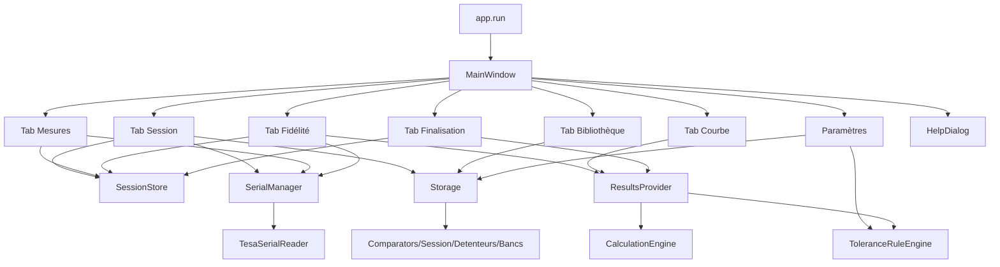

## EtaComp2K25 — Carte du code (fichiers, rôles, liaisons)

*Dernière mise à jour : 18 février 2026*

### Sommaire
- [1. Points d’entrée et bootstrap](#1-points-dentrée-et-bootstrap)
- [2. UI (onglets, widgets, thèmes)](#2-ui-onglets-widgets-thèmes)
- [3. Domaine et calculs](#3-domaine-et-calculs)
- [4. Règles et évaluation](#4-règles-et-évaluation)
- [5. I/O série, stockage et état](#5-io-série-stockage-et-état)
- [6. Outils et tests](#6-outils-et-tests)
- [7. Flux exécutable principal](#7-flux-exécutable-principal)
- [8. Diagramme de dépendances (Mermaid)](#8-diagramme-de-dépendances-mermaid)
- [9. ADR](#9-adr)

## 1. Points d’entrée et bootstrap

- `pyproject.toml`: `etacomp = etacomp.app:run`
- `src/etacomp/__main__.py`: exécute `run()`
- `src/etacomp/app.py`:
  - Crée `QApplication`.
  - Charge préférences (`config/prefs.py`) et QSS (`ui/themes`).
  - Ouvre `ui/main_window.MainWindow` (maximisée).

## 2. UI (onglets, widgets, thèmes)

- `ui/main_window.py`:
  - Onglets:
    - `tabs/session.py`: métadonnées + connexion COM.
    - `tabs/measures.py`: campagne, tableau, log série, sauvegarde session.
    - `tabs/library.py`: CRUD comparateurs.
    - `tabs/fidelity_gap.py`: placeholder.
    - `tabs/calibration_curve.py`: placeholder (Matplotlib prévu).
    - `tabs/finalization.py`: résultats d’erreurs + verdict (placeholders calculs, export TODO).
    - `ui/settings.py` (incl. `ui/tabs/settings_rules.py`): préférences et règles.
  - Menu Aide: `ui/help_dialog.py`.

- `ui/tabs/session.py`:
  - Champs: opérateur/date/temp/humi/comparateur/itérations/mesures/obs.
  - Connexion série: ports/baud/connect/disconnect (via `serial_manager`).
  - Métadonnées ↔ `session_store`.

- `ui/tabs/measures.py`:
  - Tableau: colonnes=cibles, lignes=cycles ↑/moyenne ↑/cycles ↓/moyenne ↓ + ligne indices.
  - Avancement: `current_cycle`, `current_phase_up`, `current_col`, `waiting_zero`.
  - Réception série: `line_received(raw, value)` → écriture cellule → avance → renvoi commande si “À la demande”.
  - Sauvegarde session.

- `ui/tabs/library.py`:
  - Table 6 colonnes, dialogue d’édition `ComparatorEditDialog`.
  - Appels `io/storage` pour persister.

- `ui/tabs/finalization.py`:
  - Charge moteur de règles (défaut ou fichier).
  - “Calculer les erreurs”: résultats neutres et messages; tables d’affichage; export PDF/HTML TODO.

- `ui/settings.py`:
  - Thème (light/dark), valeurs par défaut session, autosave, langue, data dir, onglet Règles.
  - Signal `themeChanged` + application QSS.

- `ui/tabs/settings_rules.py`:
  - Éditeur CRUD des règles par famille; import/export/restauration; validation live.

- `ui/help_dialog.py`:
  - Viewer Markdown (ToC, recherche/surlignage, export PDF, reload).
  - Fichier par défaut: `resources/help/aid.md`.

- `ui/themes/__init__.py`:
  - Génération QSS avec placeholders; `apply_theme`, `load_theme_qss`.

- `ui/widgets/section_header.py`:
  - Petit widget d’en-tête stylé.

## 3. Domaine et calculs

- `models/comparator.py`: `ComparatorProfile` (11 cibles, periodicite_controle_mois 1–120).
- `models/session.py`: `Session` (holder_ref, banc_ref, fidelity), `MeasureSeries`, `FidelitySeries`, `SessionV2`, `Measurement`, `Series`.
- `models/detenteur.py`: `Detenteur` (code_es, libelle).
- `models/banc_etalon.py`: `BancEtalon` (reference, marque_capteur, date_validite, is_default).
- `core/session_adapter.py`: `build_session_from_runtime(Session)` → `SessionV2`.
- `core/calculation_engine.py`: `CalculationEngine.compute(SessionV2)` → `CalculatedResults` (Emt, Eml, Eh, Ef).
- `calculations/errors.py`: pont `compute_from_runtime_session` → `CalculationEngine`.
- `ui/results_provider.py`: agrège SessionV2, calculs, verdict; `compute_all(rt_session)`.

## 4. Règles et évaluation

- `rules/tolerances.py`: `ToleranceRuleEngine` (UI édition), `load/save/validate/match`, règles par défaut.
- `rules/tolerance_engine.py` et `rules/verdict.py`: verdict, matching. Règles par famille: `normale`, `grande`, `faible`, `limitee`.
  - `Verdict`: statut “apte/inapte/indetermine”, dépassements, messages.
  - Chemin par défaut: `~/.EtaComp2K25/rules/tolerances.json`.

## 5. I/O série, stockage et état

- `io/serialio.py`: `SerialConnection`, `SerialReaderThread`, `list_serial_ports()`.
- `io/tesa_reader.py`: `TesaSerialReader` (silence/EOL, masque 7-bit, regex valeur, decimals).
- `io/serial_manager.py`: `SerialManager` (TesaSerialReader ou SerialReaderThread), config envoi, signaux.
- `io/storage.py`:
  - Comparateurs, sessions (`{ref}_{date}.json`), détenteurs, bancs étalon, export_config.
- `state/session_store.py`:
  - `update_metadata` (holder_ref, banc_ref), `set_series`, `set_fidelity`, `save`, `load_from_file`.

## 6. Outils et tests

- Outils: `tools/migrate_comparators.py`, `tools/migrate_tolerances.py`, `tools/serial_probe.py`.
- Tests: `test_tolerances_engine.py`, `test_tolerance_engine.py`, `test_tolerance_engine_intervals.py`, `test_comparator_profile.py`, `test_calculation_engine.py`, `test_ui_results_provider.py`, `test_smoke.py`.

## 7. Flux exécutable principal

- `etacomp` → `app.run()` → UI → `MainWindow`:
  - `Session`: métadonnées (détenteur, banc), COM, enregistrer session.
  - `Mesures`: campagne → flux TESA → tableau → `session_store`.
  - `Écarts fidélité`: capture S5 → `session_store.set_fidelity`.
  - `Courbe`: `ResultsProvider.compute_all` → graphe.
  - `Finalisation`: calcul erreurs + verdict (CalculationEngine + evaluate_tolerances).
  - `Paramètres`: Règles, Détenteurs, Bancs, Exports, TESA.

## 8. Diagramme de dépendances (Mermaid)

## 9. ADR

- ADR‑010: Le tableau de campagne est construit côté UI (simplicité d’implémentation).
- ADR‑011: Les fichiers utilisateur sont stockés dans `~/.EtaComp2K25` (portabilité).
- ADR‑012: Les règles sont éditables via UI et validées à la volée (UX priorisé).
- ADR‑013: Scripts de migration distribués pour accompagner l’évolution des formats JSON.

