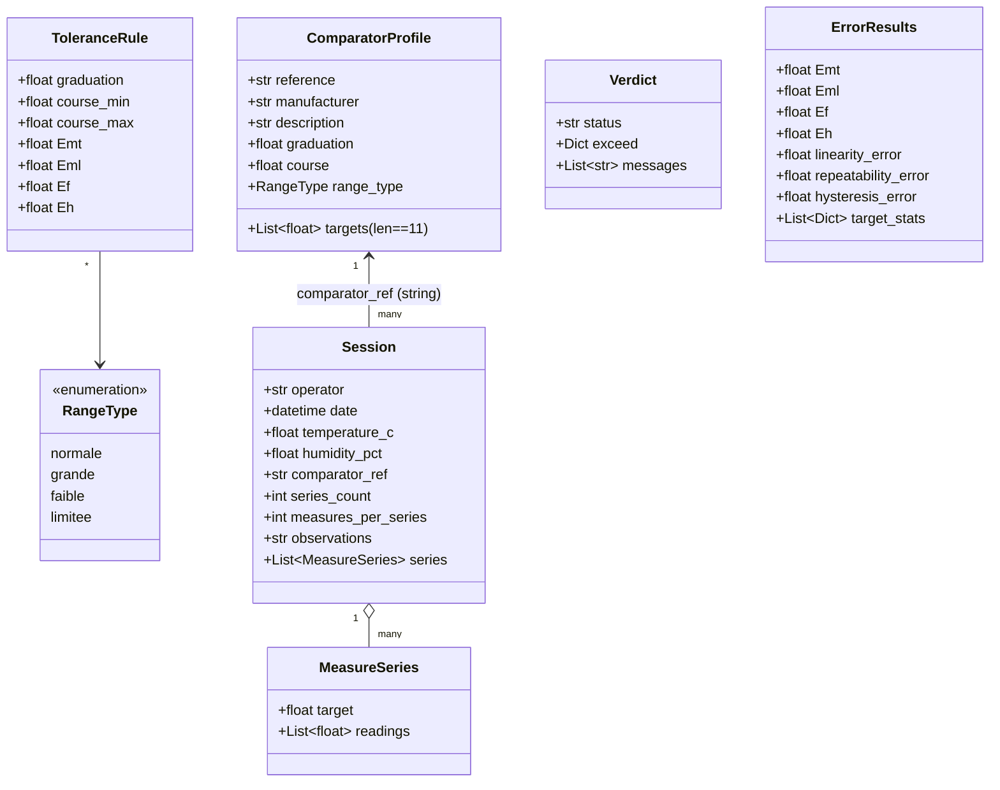

## EtaComp2K25 — Modèle de données (rétro‑ingénierie)

### Sommaire
- [1. Classes et structures](#1-classes-et-structures)
- [2. Contraintes et validations](#2-contraintes-et-validations)
- [3. Persistences JSON et schémas](#3-persistences-json-et-schémas)
- [4. Diagrammes de données (Mermaid)](#4-diagrammes-de-données-mermaid)
- [5. Écarts et alignements à prévoir](#5-écarts-et-alignements-à-prévoir)
- [6. ADR](#6-adr)

## 1. Classes et structures

- `RangeType` (Enum): `normale | grande | faible | limitee`, `display_name`.
- `ComparatorProfile` (Pydantic):
  - `reference: str`
  - `manufacturer?: str`
  - `description?: str`
  - `graduation: float (>0)`
  - `course: float (>0)`
  - `range_type: RangeType`
  - `targets: List[float]` (exactement 11)
  - Helpers: `filename`, `load_profile`, `save_profile`.
- `Session` (Pydantic):
  - `operator: str`
  - `date: datetime`
  - `temperature_c?: float`
  - `humidity_pct?: float`
  - `comparator_ref?: str`
  - `series_count: int`
  - `measures_per_series: int`
  - `observations?: str`
  - `series: List[MeasureSeries]`
- `MeasureSeries` (Pydantic):
  - `target: float`
  - `readings: List[float]`
- `ToleranceRule` (dataclass):
  - `graduation: float`
  - `course_min?: float` / `course_max?: float` (normale/grande)
  - `Emt, Eml, Ef, Eh: float (>=0)`
- `ToleranceRuleEngine`:
  - `rules: Dict[str, List[ToleranceRule]]`
  - `load/save/validate/match/evaluate`
- `Verdict` (dataclass): `status`, `rule?`, `exceed?`, `messages`.
- `ErrorResults` (dataclass): `Emt/Eml/Ef/Eh`, `linearity_error`, `repeatability_error`, `hysteresis_error`, `target_stats`.

## 2. Contraintes et validations

- Profils comparateurs:
  - 11 cibles exactement; première cible 0.0 (tolérance `1e-6`).
  - Toutes cibles dans `[0, course]`, suite non‑décroissante.
  - `graduation > 0`, `course > 0`.
- Règles:
  - `graduation > 0`.
  - `course_min ≤ course_max` (si présents), pas de `course_*` pour faible/limitée.
  - Pas de chevauchement de plages; unicité de graduation pour faible/limitée.
  - `Emt/Eml/Ef/Eh ≥ 0`.

## 3. Persistences JSON et schémas

- Comparateurs: `~/.EtaComp2K25/comparators/*.json`
  - Structure ≈ `ComparatorProfile`.
- Sessions: `~/.EtaComp2K25/sessions/*.json`
  - Structure ≈ `Session` + `series: [{target, readings[]}]`.
- Règles: `~/.EtaComp2K25/rules/tolerances.json`
  - `{ "normale": [ToleranceRule], "grande": [...], "faible": [...], "limitee": [...] }`.
- Préférences: `~/.EtaComp2K25/config.json`
  - `theme`, `default_*`, `autosave_*`, `language`, `help{last_*}`.

## 4. Diagrammes de données (Mermaid)

## 5. Écarts et alignements à prévoir

- `ErrorCalculator` attend `series.measurements` et `direction` (ascending/descending), alors que le modèle actuel expose `readings` sans direction. Un alignement de modèle sera nécessaire pour activer les calculs réels.
- JSON non versionnés (sessions/règles); ajouter `schema_version` simplifierait les évolutions.

## 6. ADR

- ADR‑020: Validations strictes Pydantic sur `ComparatorProfile` (qualité des données).
- ADR‑021: Stockage JSON lisible (interop et debug).
- ADR‑022: Moteur de règles séparé (facilite l’édition/validation et la testabilité).
- ADR‑023: Calculs d’erreurs définis mais à intégrer après alignement de modèle.

