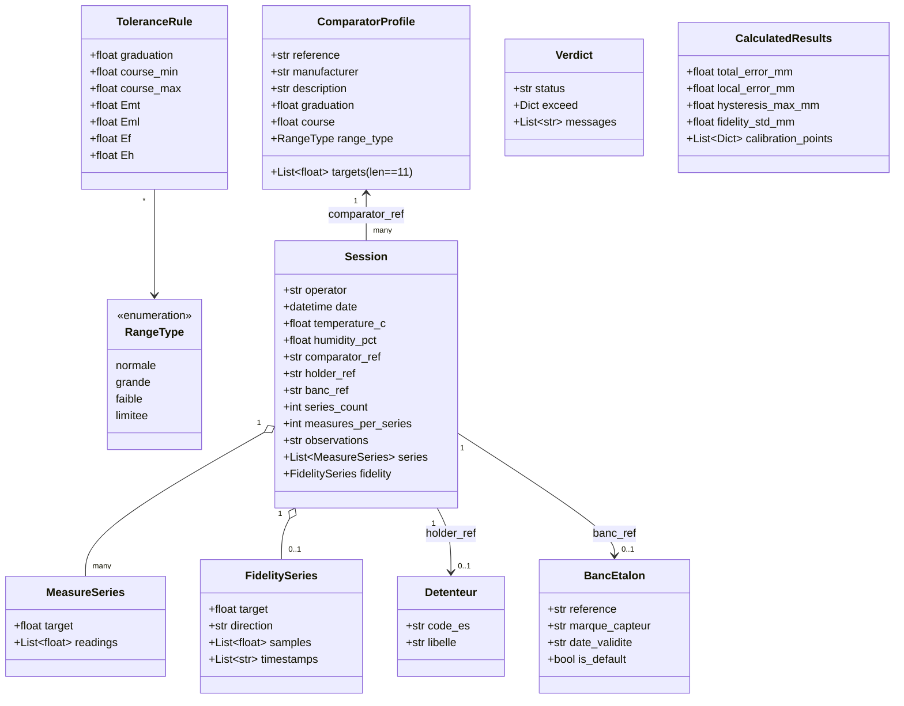

## EtaComp2K25 — Modèle de données (rétro‑ingénierie)

*Dernière mise à jour : 18 février 2026*

### Sommaire
- [1. Classes et structures](#1-classes-et-structures)
- [2. Contraintes et validations](#2-contraintes-et-validations)
- [3. Persistences JSON et schémas](#3-persistences-json-et-schémas)
- [4. Diagrammes de données (Mermaid)](#4-diagrammes-de-données-mermaid)
- [5. Écarts et alignements à prévoir](#5-écarts-et-alignements-à-prévoir)
- [6. ADR](#6-adr)

## 1. Classes et structures

- `RangeType` (Enum): `normale | grande | faible | limitee`, `display_name`.
- `ComparatorProfile` (Pydantic):
  - `reference: str`, `manufacturer?`, `description?`
  - `graduation: float (>0)`, `course: float (>0)`, `range_type: RangeType`
  - `targets: List[float]` (exactement 11)
  - `periodicite_controle_mois: int` (1–120, défaut 12)
- `Session` (Pydantic):
  - `operator: str`, `date: datetime`, `temperature_c?`, `humidity_pct?`
  - `comparator_ref?`, `holder_ref?`, `banc_ref?`
  - `series_count`, `measures_per_series`, `observations?`
  - `series: List[MeasureSeries]`, `fidelity?: FidelitySeries`
- `MeasureSeries` (Pydantic): `target: float`, `readings: List[float]`
- `FidelitySeries` (Pydantic): `target`, `direction` (up/down), `samples: List[float]`, `timestamps`
- `Detenteur` (Pydantic): `code_es: str`, `libelle: str`
- `BancEtalon` (Pydantic): `reference`, `marque_capteur`, `date_validite`, `is_default`
- `ExportConfig` (Pydantic): `entite`, `image_path?`, `document_title`, `document_reference`, `texte_normes`
- `ToleranceRule` (dataclass):
  - `graduation: float`
  - `course_min?: float` / `course_max?: float` (normale/grande)
  - `Emt, Eml, Ef, Eh: float (>=0)`
- `ToleranceRuleEngine`:
  - `rules: Dict[str, List[ToleranceRule]]`
  - `load/save/validate/match/evaluate`
- `Verdict` (dataclass): `status`, `rule?`, `exceed?`, `messages`.
- `CalculatedResults` (dataclass): `total_error_mm`, `local_error_mm`, `hysteresis_max_mm`, `fidelity_std_mm?`, `calibration_points`, localisations.

## 2. Contraintes et validations

- Profils comparateurs:
  - 11 cibles exactement; première cible 0.0 (tolérance `1e-6`).
  - Toutes cibles dans `[0, course]`, suite non‑décroissante.
  - `graduation > 0`, `course > 0`.
- Règles:
  - `graduation > 0`.
  - `course_min ≤ course_max` (si présents), pas de `course_*` pour faible/limitée.
  - Pas de chevauchement de plages; unicité de graduation pour faible/limitée.
  - `Emt/Eml/Ef/Eh ≥ 0`.

## 3. Persistences JSON et schémas

- Comparateurs: `~/.EtaComp2K25/comparators/*.json` — Structure ≈ `ComparatorProfile` (avec periodicite_controle_mois).
- Sessions: `~/.EtaComp2K25/sessions/{ref}_{YYYYMMDD_HHMMSS}.json` — Structure ≈ `Session` + `series` + `fidelity?`.
- Détenteurs: `~/.EtaComp2K25/detenteurs.json` — `{ "detenteurs": [{code_es, libelle}] }`.
- Bancs étalon: `~/.EtaComp2K25/bancs_etalon.json` — `{ "bancs": [{reference, marque_capteur, date_validite, is_default}] }`.
- Export: `~/.EtaComp2K25/export_config.json` — entite, image_path, document_title, document_reference, texte_normes.
- Règles: `~/.EtaComp2K25/rules/tolerances.json` — `{ "normale": [...], "grande": [...], "faible": [...], "limitee": [...] }`.
- Préférences: `~/.EtaComp2K25/config.json` — theme, default_*, autosave_*, language.
- TESA: `~/.EtaComp2K25/tesa_config.json` — frame_mode, silence_ms, eol, decimals, etc.

## 4. Diagrammes de données (Mermaid)

## 5. Écarts et alignements à prévoir

- **Alignement effectué** : `session_adapter` convertit Session (readings) → SessionV2 (measurements + direction). `CalculationEngine` calcule Emt, Eml, Eh, Ef. `ResultsProvider` agrège tout.
- JSON sessions non versionnés ; SessionV2 possède schema_version en interne.
- Deux moteurs de règles coexistent : `tolerance_engine` (verdict) et `tolerances` (UI édition).

## 6. ADR

- ADR‑020: Validations strictes Pydantic sur `ComparatorProfile` (qualité des données).
- ADR‑021: Stockage JSON lisible (interop et debug).
- ADR‑022: Moteur de règles séparé (facilite l’édition/validation et la testabilité).
- ADR‑023: Calculs d’erreurs définis mais à intégrer après alignement de modèle.

